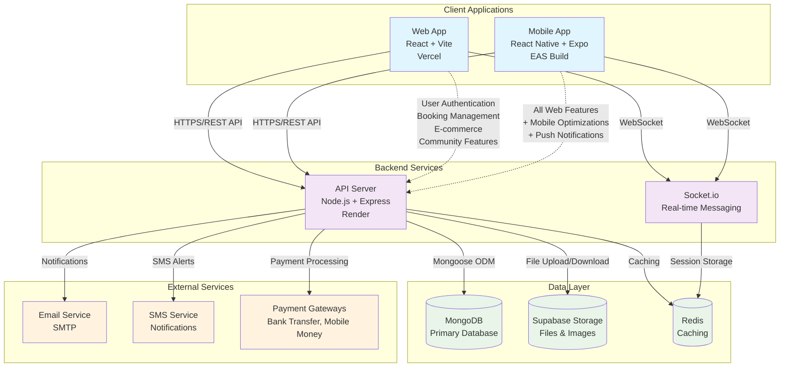

# MCAN Lodge - Comprehensive Project Documentation

## Table of Contents
1. [Project Overview](#project-overview)
2. [System Architecture](#system-architecture)
3. [Visual Architecture Diagram](#visual-architecture-diagram)
4. [Technical Stack](#technical-stack)
5. [Directory Structure](#directory-structure)
6. [Database Schema](#database-schema)
7. [Setup and Getting Started](#setup-and-getting-started)
8. [API Documentation](#api-documentation)
9. [Deployment Information](#deployment-information)
10. [Key Features](#key-features)

---

## Project Overview

**MCAN Lodge** is a comprehensive digital platform designed for the **Muslim Corpers' Association of Nigeria (MCAN)**. It serves as an all-in-one solution for managing Islamic accommodation bookings, community engagement, e-commerce, and educational programs.

### What Does MCAN Lodge Do?

In simple terms, MCAN Lodge is like a combination of:
- **Airbnb for Islamic accommodations** - Users can browse and book Islamic-friendly lodging
- **Facebook for Muslim communities** - Members can join communities, share posts, and communicate
- **Amazon for Islamic products** - An e-commerce platform selling Islamic books, clothing, and religious items
- **Eventbrite for Islamic programs** - Users can register for Quran classes, lectures, and community events
- **WhatsApp for customer support** - Real-time messaging between users and administrators

### Target Users
- **NYSC Corps Members** - Young Nigerians serving their country who need Islamic-friendly accommodation
- **Muslim Travelers** - Anyone seeking halal accommodation and Islamic community connections
- **Islamic Community Members** - People wanting to join Islamic educational programs and purchase religious items
- **Administrators** - MCAN staff managing bookings, payments, and community activities

### Core Purpose
The platform solves the challenge of finding Islamic-compliant accommodation and community support for Muslims, particularly NYSC corps members, while providing a complete ecosystem for Islamic lifestyle needs including education, shopping, and community engagement.

---

## System Architecture

MCAN Lodge follows a modern **multi-platform architecture** with three main components:

### 1. Frontend (Web Application)
- **Technology**: React.js with Vite
- **Purpose**: Main web interface for users to access all platform features
- **Location**: `mcanlogde1-master/client/`
- **Deployment**: Vercel (https://mcanlogde1.vercel.app/)

### 2. Backend (API Server)
- **Technology**: Node.js with Express.js
- **Purpose**: Handles all business logic, database operations, and API endpoints
- **Location**: `mcanlogde1-master/server/`
- **Deployment**: Render (https://mcanlogde1.onrender.com)

### 3. Mobile Application
- **Technology**: React Native with Expo
- **Purpose**: Native mobile app providing all web features optimized for mobile
- **Location**: `mcanlogde1-master/mobile/`
- **Deployment**: Expo Application Services (EAS)

### 4. Database & Storage
- **Primary Database**: MongoDB (document-based storage)
- **File Storage**: Supabase Storage (images, documents, payment proofs)
- **Caching**: Redis (optional, for performance)
- **Real-time Communication**: Socket.io

---

## Visual Architecture Diagram



---

## Technical Stack

### Frontend Technologies
- **React 18.3.1** - Modern UI library with hooks and functional components
- **Vite 5.4.10** - Fast build tool and development server
- **Tailwind CSS 3.4.14** - Utility-first CSS framework for styling
- **React Router DOM 6.28.0** - Client-side routing
- **Axios 1.7.7** - HTTP client for API communication
- **Socket.io Client 4.7.0** - Real-time communication
- **React Hot Toast** - User notifications
- **React Quill** - Rich text editor for content creation

### Backend Technologies
- **Node.js** - JavaScript runtime environment
- **Express.js 4.21.1** - Web application framework
- **MongoDB 6.13.0** - NoSQL document database
- **Mongoose 8.8.1** - MongoDB object modeling
- **JWT (jsonwebtoken 9.0.2)** - Authentication tokens
- **Socket.io 4.7.0** - Real-time bidirectional communication
- **Multer 2.0.1** - File upload handling
- **Bcryptjs 2.4.3** - Password hashing
- **Nodemailer 7.0.5** - Email sending
- **PDFKit 0.17.1** - PDF generation for receipts

### Mobile Technologies
- **React Native 0.79.5** - Cross-platform mobile development
- **Expo 53.0.20** - Development platform and build service
- **TypeScript 5.8.3** - Type safety and better development experience
- **React Navigation 7.x** - Navigation library for mobile
- **Expo Secure Store** - Secure storage for sensitive data
- **Expo Notifications** - Push notifications

### Database & Storage
- **MongoDB** - Primary database for all application data
- **Supabase Storage** - Cloud storage for images and files
- **Redis** - Optional caching layer for improved performance

---

## Directory Structure

```
mcanlogde1-master/
├── client/                          # Frontend React Application
│   ├── src/
│   │   ├── components/             # Reusable UI components
│   │   ├── pages/                  # Page components (routes)
│   │   ├── context/                # React Context providers
│   │   ├── hooks/                  # Custom React hooks
│   │   ├── services/               # API service functions
│   │   ├── utils/                  # Utility functions
│   │   └── assets/                 # Static assets (images, icons)
│   ├── public/                     # Public static files
│   ├── package.json               # Frontend dependencies
│   └── vite.config.js             # Vite configuration
│
├── server/                          # Backend Node.js Application
│   ├── src/
│   │   ├── models/                 # MongoDB/Mongoose models
│   │   ├── controllers/            # Route handlers and business logic
│   │   ├── routes/                 # API route definitions
│   │   ├── middlewares/            # Custom middleware functions
│   │   ├── config/                 # Database and service configurations
│   │   ├── services/               # Business logic services
│   │   ├── utils/                  # Utility functions
│   │   ├── scripts/                # Database seeding and maintenance
│   │   └── uploads/                # File upload storage
│   ├── package.json               # Backend dependencies
│   └── index.js                   # Server entry point
│
├── mobile/                          # React Native Mobile Application
│   ├── src/
│   │   ├── components/             # Mobile UI components
│   │   ├── screens/                # Mobile screen components
│   │   ├── navigation/             # Navigation configuration
│   │   ├── services/               # Mobile-specific services
│   │   ├── hooks/                  # Custom mobile hooks
│   │   ├── types/                  # TypeScript type definitions
│   │   └── utils/                  # Mobile utility functions
│   ├── assets/                     # Mobile assets
│   ├── package.json               # Mobile dependencies
│   ├── app.json                   # Expo configuration
│   └── App.tsx                    # Mobile app entry point
│
└── docs/                           # Project documentation
    ├── TECHNICAL_IMPLEMENTATION.md
    ├── DEPLOYMENT_GUIDE.md
    ├── PAYMENT_SYSTEM_DOCUMENTATION.md
    └── [other documentation files]
```

