# MCAN Lodge - Visual Architecture Diagram

## System Architecture Overview

This diagram shows the complete system architecture of MCAN Lodge, including all components, data flows, and integration points.

```mermaid
graph TB
    subgraph "Client Applications"
        WEB[Web Application<br/>React + Vite<br/>Deployed on Vercel<br/>https://mcanlogde1.vercel.app/]
        MOBILE[Mobile Application<br/>React Native + Expo<br/>iOS & Android<br/>EAS Build Service]
    end
    
    subgraph "Backend Services"
        API[API Server<br/>Node.js + Express<br/>Deployed on Render<br/>https://mcanlogde1.onrender.com]
        SOCKET[Socket.io Server<br/>Real-time Communication<br/>WebSocket Protocol]
        AUTH[Authentication Service<br/>JWT Token Management<br/>Role-based Access Control]
    end
    
    subgraph "Data Storage Layer"
        MONGO[(MongoDB Database<br/>Primary Data Store<br/>User, Booking, Product Data)]
        SUPABASE[(Supabase Storage<br/>File & Image Storage<br/>Payment Proofs, Profile Images)]
        REDIS[(Redis Cache<br/>Session Storage<br/>Performance Optimization)]
    end
    
    subgraph "External Services"
        EMAIL[Email Service<br/>SMTP Notifications<br/>Booking Confirmations]
        SMS[SMS Service<br/>Mobile Notifications<br/>Payment Alerts]
        PAYMENT[Payment Systems<br/>Bank Transfer<br/>Mobile Money<br/>Manual Verification]
    end
    
    subgraph "Core Features"
        BOOKING[Accommodation Booking<br/>• Search & Filter<br/>• Booking Management<br/>• Payment Tracking]
        ECOMMERCE[E-commerce Platform<br/>• Product Catalog<br/>• Shopping Cart<br/>• Order Management]
        COMMUNITY[Community Platform<br/>• Islamic Communities<br/>• Real-time Chat<br/>• Content Sharing]
        EDUCATION[Educational Programs<br/>• Quran Classes<br/>• Islamic Lectures<br/>• Event Registration]
    end
    
    %% Client to Backend Connections
    WEB -->|HTTPS REST API<br/>Authentication<br/>Data Operations| API
    WEB -->|WebSocket<br/>Real-time Messaging<br/>Live Updates| SOCKET
    MOBILE -->|HTTPS REST API<br/>Mobile Optimized<br/>Push Notifications| API
    MOBILE -->|WebSocket<br/>Real-time Features<br/>Chat & Updates| SOCKET
    
    %% Backend Internal Connections
    API --> AUTH
    SOCKET --> AUTH
    API --> BOOKING
    API --> ECOMMERCE
    API --> COMMUNITY
    API --> EDUCATION
    
    %% Backend to Data Layer
    API -->|Mongoose ODM<br/>CRUD Operations<br/>Data Validation| MONGO
    API -->|File Upload/Download<br/>Image Processing<br/>Document Storage| SUPABASE
    API -->|Caching<br/>Session Management<br/>Performance| REDIS
    SOCKET -->|Session Storage<br/>Real-time State<br/>Connection Management| REDIS
    
    %% Backend to External Services
    API -->|Email Notifications<br/>Booking Confirmations<br/>Password Reset| EMAIL
    API -->|SMS Alerts<br/>Payment Reminders<br/>Urgent Notifications| SMS
    API -->|Payment Processing<br/>Verification<br/>Receipt Generation| PAYMENT
    
    %% Data Flow Annotations
    WEB -.->|User Registration<br/>Accommodation Booking<br/>Product Shopping<br/>Community Participation| API
    MOBILE -.->|All Web Features<br/>Mobile Optimizations<br/>Offline Capabilities<br/>Push Notifications| API
    
    %% Feature Data Flows
    BOOKING -.->|Booking Data<br/>Payment Records<br/>User Preferences| MONGO
    ECOMMERCE -.->|Product Data<br/>Order History<br/>Inventory Management| MONGO
    COMMUNITY -.->|Community Posts<br/>Messages<br/>User Interactions| MONGO
    EDUCATION -.->|Program Data<br/>Enrollments<br/>Progress Tracking| MONGO
    
    %% Styling
    classDef frontend fill:#e3f2fd,stroke:#1976d2,stroke-width:2px
    classDef backend fill:#f3e5f5,stroke:#7b1fa2,stroke-width:2px
    classDef database fill:#e8f5e8,stroke:#388e3c,stroke-width:2px
    classDef external fill:#fff3e0,stroke:#f57c00,stroke-width:2px
    classDef features fill:#fce4ec,stroke:#c2185b,stroke-width:2px
    
    class WEB,MOBILE frontend
    class API,SOCKET,AUTH backend
    class MONGO,SUPABASE,REDIS database
    class EMAIL,SMS,PAYMENT external
    class BOOKING,ECOMMERCE,COMMUNITY,EDUCATION features
```



## Component Descriptions

### Client Applications (Blue)
- **Web Application**: React-based web interface deployed on Vercel
- **Mobile Application**: React Native app built with Expo for iOS and Android

### Backend Services (Purple)
- **API Server**: Main Node.js/Express server handling all business logic
- **Socket.io Server**: Real-time communication service for messaging and live updates
- **Authentication Service**: JWT-based authentication and authorization system

### Data Storage Layer (Green)
- **MongoDB Database**: Primary database storing all application data
- **Supabase Storage**: Cloud storage for files, images, and documents
- **Redis Cache**: Optional caching layer for improved performance

### External Services (Orange)
- **Email Service**: SMTP-based email notifications
- **SMS Service**: Mobile notifications and alerts
- **Payment Systems**: Integration with various payment methods

### Core Features (Pink)
- **Accommodation Booking**: Complete booking management system
- **E-commerce Platform**: Online shopping for Islamic products
- **Community Platform**: Social features and community management
- **Educational Programs**: Islamic learning and event management

## Data Flow Patterns

### 1. **User Authentication Flow**
```
Client → API Server → Authentication Service → MongoDB → Response
```

### 2. **Booking Process Flow**
```
Client → API Server → Booking Service → MongoDB + Supabase → Email/SMS Notifications
```

### 3. **Real-time Messaging Flow**
```
Client ↔ Socket.io Server ↔ Redis Cache ↔ MongoDB
```

### 4. **File Upload Flow**
```
Client → API Server → Supabase Storage → Database Reference → Response
```

## Integration Points

### API Endpoints
- **Authentication**: `/api/auth/*`
- **Bookings**: `/api/bookings/*`
- **Products**: `/api/products/*`
- **Communities**: `/api/communities/*`
- **Messages**: `/api/messages/*`
- **Payments**: `/api/payments/*`

### Real-time Events
- **booking_update**: Booking status changes
- **new_message**: Direct messages
- **community_message**: Community chat
- **payment_verified**: Payment confirmations
- **user_presence**: Online/offline status

### External Integrations
- **Supabase**: File storage and management
- **Email SMTP**: Automated notifications
- **SMS Gateway**: Mobile alerts
- **Payment Gateways**: Transaction processing

This architecture ensures scalability, maintainability, and clear separation of concerns while providing a robust foundation for the MCAN Lodge platform.
